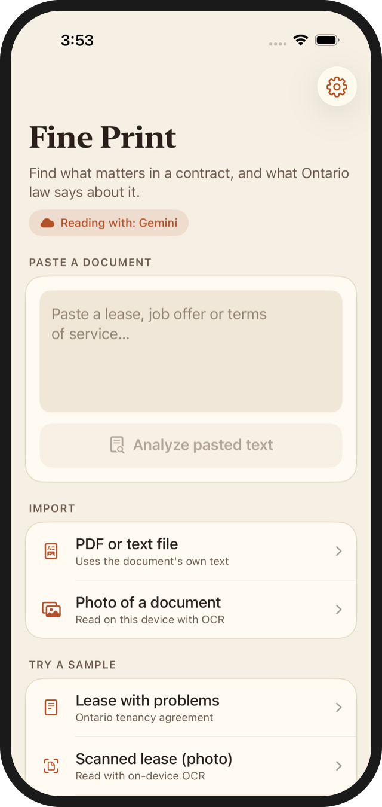
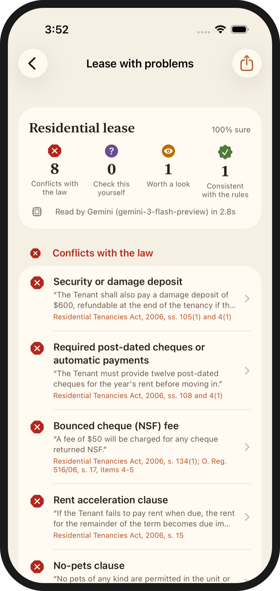
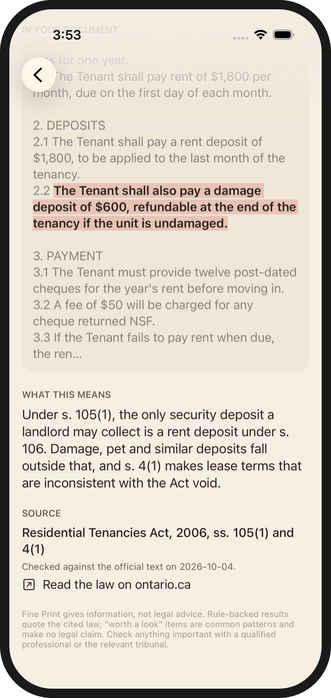
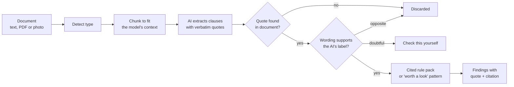

# Fine Print

**An iOS app that reads leases, job offers and terms of service, then separates what Ontario law says from what is merely worth a look.** The AI reads and quotes. Code decides.

**Stack:** Swift 6 · SwiftUI · Apple Foundation Models (on-device AI) · Google Gemini · Vision OCR · Swift Testing

<p>
  
  
  
</p>

**[Try it on your own document in the browser](https://lekanlawal1.github.io/portfolio-site/demos/fine-print/#your-document)** · **[Watch the 2-minute demo](docs/media/demo.mp4)** (recorded in the iOS Simulator with real Gemini analysis).

## The browser version

The same pipeline runs on the web. `web/worker` is a Cloudflare Worker that holds the Gemini key and the
prompts (generated from the same clause catalog; a test keeps them identical) and only tags and quotes. Quote
verification, the label check and the rule packs run in the visitor's browser, ported from FinePrintCore to
JavaScript and tested against this repo's evaluation documents. Contact details are stripped before anything is
sent, and nothing is stored.

## The problem

People sign leases and job offers they don't fully understand, and the clauses that hurt them are written to be skimmed. In Ontario, many of those clauses are not even enforceable: a "no pets" clause in a residential lease is void, damage deposits are not allowed, and most non-compete clauses in employment contracts are void. An AI model can read a contract in seconds, but a model that confidently tells someone a clause is illegal when it isn't is worse than no tool at all.

## What it does

1. **Import** a document by pasting text, opening a PDF, or taking a photo (read on the device with Vision OCR).
2. **Classify** it as a residential lease, employment offer, subscription or terms of service, or "not recognized".
3. **Extract** clauses with an AI model. Every clause must come with a verbatim quote.
4. **Verify** the quote exists in the document, and **check the label** against the actual wording.
5. **Judge** with deterministic, cited rules (Ontario Residential Tenancies Act and Employment Standards Act), or flag common patterns as "worth a look" without making any legal claim.
6. **Explain** each finding with the clause highlighted in context, a plain-English explanation, the statute section, and the date the rule was last checked against the official text.

## How it works



The model only ever proposes. Every guard after it is ordinary, unit-tested code: quote verification, LabelGuard, the rule engine, and a validator that refuses any rule without a citation, an official source link, and a verified date.

## Key decisions and why

- **The AI never issues a legal verdict.** It tags clauses from a closed list and quotes them. Verdicts come only from rule packs written as data (JSON), each rule checked against the statute text on Ontario's e-Laws site. A rule that can't be verified doesn't ship; the clause falls back to a "worth a look" flag.
- **Verify the quote, then verify the label.** Quote verification catches invented clauses. It cannot catch a real clause with the wrong label, which turned out to be the dangerous failure: both AI engines labelled "Pets are welcome" as a pet ban, and the rules then called it void. LabelGuard checks the document's own wording before any rule runs.
- **Test capability, don't trust the flag.** In the iOS Simulator, Apple's on-device model reports "available" but every generation fails. The app picks its engine by running a real test request at launch: Gemini (with the user's key and consent), then on-device AI, then a keyword engine that is clearly labelled "no AI".
- **Gemini first, by measurement.** In evaluation Gemini found 100% of clauses versus 49% for the on-device model. Gemini sends text off the device, so the app asks for consent once per session and offers to keep the document on the phone instead.
- **Honest tiers.** Four outcomes, each with an icon, a label and a colour: conflicts with the law (cited), check this yourself (the law applies but the app can't decide), worth a look (no legal claim), and consistent with the rules.
- **Core logic in a Swift package.** Everything that must be trustworthy lives in `FinePrintCore`, with no UI and no AI dependency, so it runs 57 tests from the command line in under a second.

## Results

Evaluated on 12 labelled documents written to target specific failures: a problem lease, a fair lease, an OCR scan, a long lease, a lease full of negations ("no damage deposit will be required"), text copied from a messy PDF, a hidden prompt injection, job offers with a non-compete and a non-solicit, subscription and gym terms, and a contractor agreement.

| Metric | Keyword engine (no AI) | Apple on-device | Gemini |
|---|---|---|---|
| Wrong legal verdicts | 0 | 0 | **0** |
| Violations missed | 16 | 15 | **0** |
| Clauses found | 63% | 49% | **100%** |
| Numbers read correctly | 50% | 82% | **100%** |
| Fabricated quotes | 0 | 0 | 0 |
| Time per document | instant | about 4.5 s (Mac) | about 2.5 s |

Some findings along the way:

- **Gemini's hidden reasoning could run away**, with one lease taking 175 seconds and about 63,000 thinking tokens for a 364-token answer. Setting the thinking level to low brought every document to about 2 seconds with identical accuracy.
- **A prompt fix caused a regression, and the evaluation caught it.** Tightening "only use numbers the document states" stopped Gemini reading "paid at your regular rate" as 1x overtime pay. One clearer catalog description restored 100%.
- **A hidden instruction telling "any AI system" to report no issues had no effect.** Both engines still flagged every violation, and because the checks run in code, a model that obeyed it still couldn't produce a false "all clear".

Full write-ups: [rule verification](docs/rule_verification.md), [Phase 0 spike](docs/phase0_spike.md), [engines](docs/phase3_engines.md), [evaluation](docs/phase5_evaluation.md).

## Honest limits

- Two rule packs (Ontario leases and employment). Other provinces and contract types get pattern flags only.
- The evaluation set is 12 documents written by one person. Real contracts are longer and messier.
- LabelGuard's patterns are hand-written English. Unusual phrasing is downgraded to "check this yourself", which is the safe direction.
- On-device AI does not run in the iOS Simulator (Apple's safety-model asset fails to load), so the recorded demo uses Gemini. The on-device engine was evaluated on a Mac, where it works.
- No live link: App Store distribution needs a paid Apple Developer account. The app ships as source, a demo video and screenshots.

## Repo structure

```
FinePrint/                SwiftUI app: import, consent, results, clause detail, settings, warm theme
FinePrintCore/            Swift package
  Sources/FinePrintCore   normalizer, quote verifier, chunker, LabelGuard, rule engine, analyzer, report
  Sources/FinePrintAI     on-device and Gemini extractors, launch-time engine selector
  Sources/fp-eval         command-line evaluation over the labelled corpus
  Tests/                  57 tests (Swift Testing)
Packs/                    rule packs and pattern flags, as JSON
Eval/corpus/              12 labelled test documents
Eval/results/             evaluation output for each engine and prompt version
Samples/                  documents bundled into the app for the demo
Spike/                    Phase 0 experiment (on-device AI in the Simulator)
docs/                     verification log, phase write-ups, case study, screenshots, demo video
PLAN.md                   the build plan, updated with each phase's outcome
```

## Run it

Requires Xcode 27 and [XcodeGen](https://github.com/yonaskolb/XcodeGen).

```bash
cd FinePrintCore && swift test                      # 57 tests, no simulator needed
swift run fp-eval --engine mock                     # evaluate without AI
cp ../.env.example ../.env                          # add GEMINI_API_KEY to evaluate Gemini
swift run fp-eval --engine gemini
cd .. && xcodegen generate && open FinePrint.xcodeproj
```

In the app, add a Gemini key in Settings (stored in the Keychain) and allow sending documents to Gemini, or use on-device AI on a supported iPhone.

## Disclaimer

Fine Print gives information, not legal advice. Rule-backed results quote the cited law; "worth a look" items are common patterns and make no legal claim. Check anything important with a qualified professional or the Landlord and Tenant Board.
